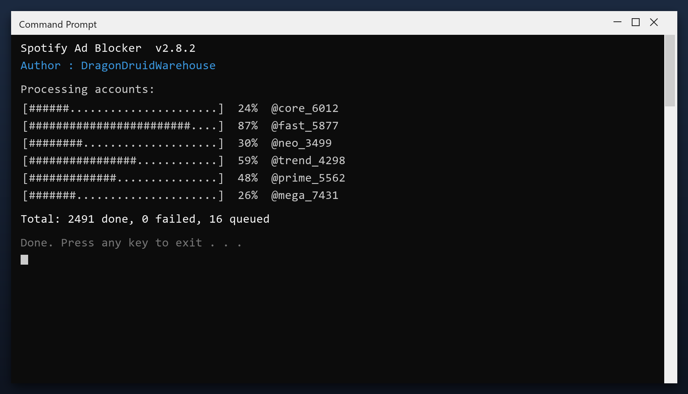

# Spotify Ad Blocker — Free Download [2026]

 

If your PC feels slower than it used to, **spotify ad blocker** is the fix. It clears the clutter that builds up over months of use and restores the speed you had on day one. Current 2026 build for Windows 10 and 11.

| | |
| --- | --- |
| **Program** | Spotify Ad Blocker |
| **Version** | Latest 2026 build |
| **Price** | Free |
| **Systems** | see requirements below |
| **Download** | Quick Start section below |

## Is this tool safe?

| **Problem** | **Solution** |
| --- | --- |
| **Low disk space** | Free up space safely |
| **Freezes and errors** | Repair system entries |
| **Manual cleaning** | One-click maintenance |
| **Fake tools** | Tested build on this page |
| **Hard to use** | Simple, plain settings |

## Does it really work?

- **Slower over time** - a PC never stays as fast as it was new
- **Long shutdowns** - Windows waits on stuck programs
- **High memory use** - idle apps keep eating RAM
- **Registry bloat** - thousands of dead entries
- **Messy downloads** - duplicate files everywhere

  

  

## How do I install it?

1. **Download** the tool with the button below
2. **Extract** the archive (WinRAR or 7-Zip)
3. **Run** the program as administrator
4. **Scan** - wait for the scan to finish
5. **Fix** - review the results and press the repair button

> **Note:** on first launch Windows may show a SmartScreen warning because the file is new. Click More info, then Run anyway.

## What will I get?

| **Component** | **Details** |
| --- | --- |
| **Program** | Tested, clean build |
| **Instructions** | Quick start guide |
| **Requirements** | Listed below |
| **License** | Free for personal use |

## What does it need?

| **Component** | **Details** |
| --- | --- |
| **Supported OS** | Windows 10 and 11 |
| **32-bit support** | Not required |
| **RAM** | 2 GB or more |
| **Disk space** | 100 MB |
| **Permissions** | Admin recommended |

## More questions

**Is admin access required?**

For a full cleanup, yes. Without it the tool only cleans your user folders.

**Will it fix my registry?**

It can scan and repair broken entries, and it backs up before changing anything.

**Does it work offline?**

Yes - once downloaded it needs no internet connection.

**How much space will I save?**

It varies, but most PCs recover several gigabytes on the first run.

## Notes

- Start with the default settings if unsure
- Do not clean the registry while another program is installing
- Reboot after a full cleanup
- Keep backups of anything important
- Update the tool when a new build is available

---

*elegant-moon-520 · Updated 2026-10-10 · Shared under the MIT License*
